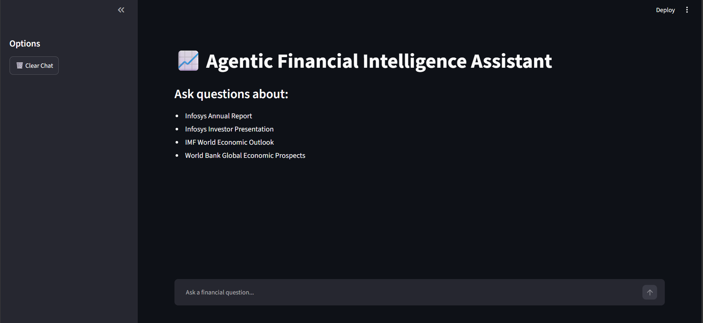
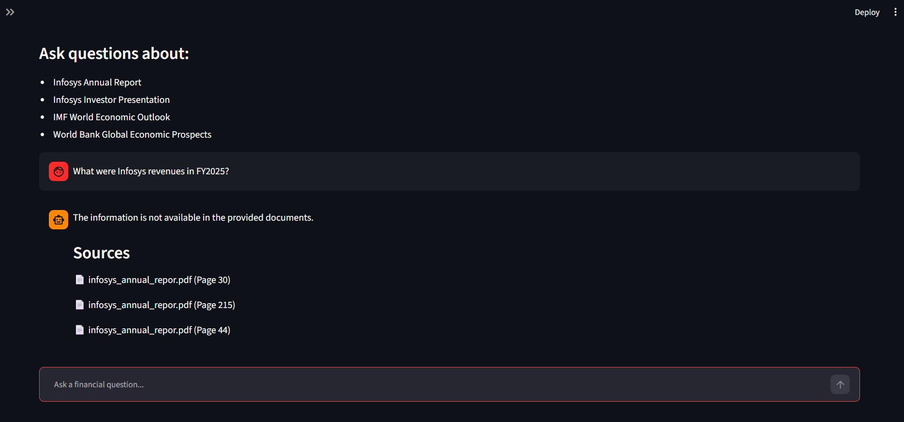
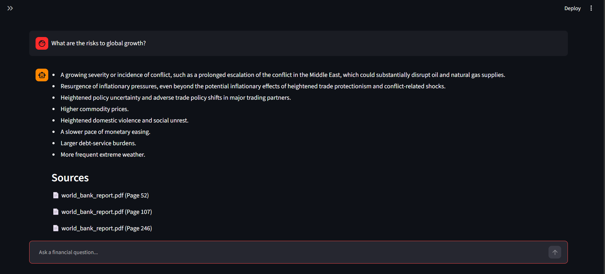

# 📈 Agentic Financial Intelligence Assistant

A Retrieval-Augmented Generation (RAG) application for financial document analysis using FAISS, LangChain, Google Gemma 2B, and Streamlit.

The system allows users to query corporate and macroeconomic reports and receive source-grounded answers with document citations.

## Tech Stack

- Python
- LangChain
- FAISS
- Sentence Transformers
- Google Gemma 2B
- Streamlit

## Documents

- Infosys Annual Report
- Infosys Investor Presentation
- IMF World Economic Outlook
- World Bank Global Economic Prospects

## Demo

### Home Interface



### Financial Question Answering



### Macroeconomic Analysis



## Results

- Indexed 800+ pages of financial reports
- Generated 3,800+ semantic chunks
- Built a FAISS vector database for semantic retrieval
- Integrated Google Gemma 2B for context-aware answer generation

## Example Questions

- What were Infosys revenues in FY2025?
- What risks to global growth were identified by the World Bank?
- What is the IMF inflation outlook?
- What growth drivers did Infosys highlight?

## Run Locally

```bash
pip install -r requirements.txt
streamlit run app.py
```

## Project Structure

```text
app.py
financial_rag_engine.py
requirements.txt
data/
screenshots/
Document_Processing_and_Vectorization.ipynb
RAG_Pipeline_Validation.ipynb
```
